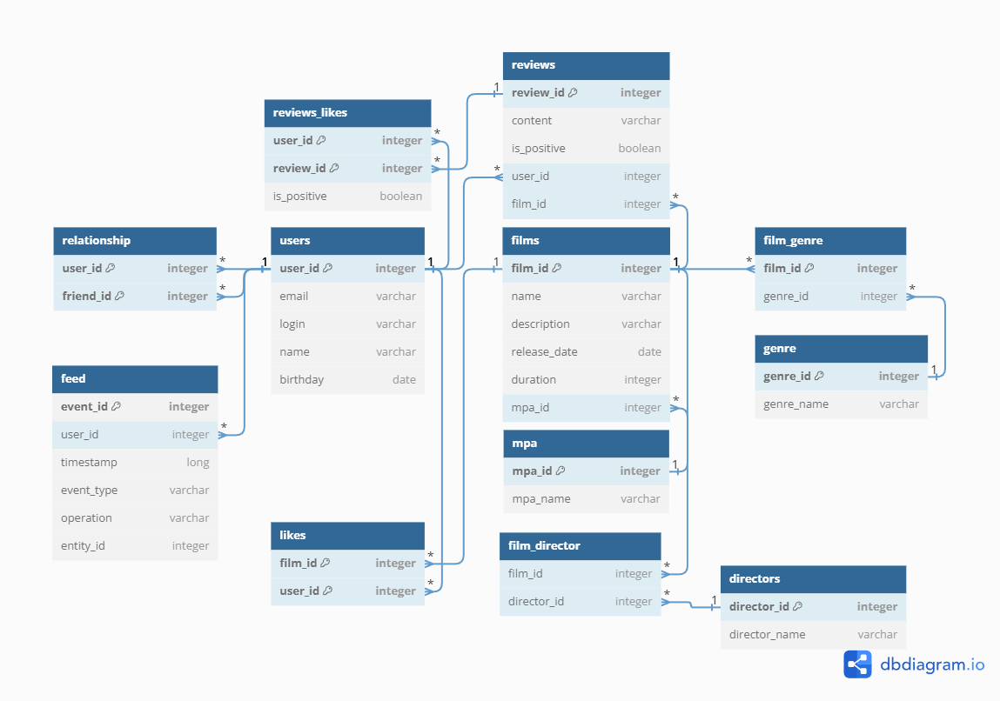

# java-filmorate
Template repository for Filmorate project.



## Примеры запросов:

1. Получение всех пользователей:
```
SELECT *
FROM user;
```

2. Получение всех фильмов:
```
SELECT *
FROM film;
```

3. Получение топ 10 наиболее популярных фильмов
```
SELECT film_id
FROM likes
GROUP BY film_id
ORDER BY COUNT(user_id) DESC
LIMIT 10;
```